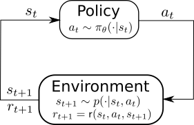
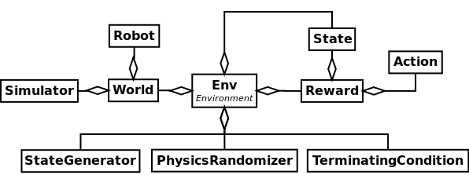

Environments
============

The environment is one of the main concept in imitation and reinforcement learning as defined in the following figures (inspired by [1]_):

    The agent-environment interaction

The environment is notably responsible to perform a step in the world, compute the next state, compute the rewards, and others.

Design
------

In PRL, the environment is an abstraction layer class that regroups:

- the world; an instance of ``World`` which will be used to perform a step in the world (simulator). This is called at each step performed by the environment.
- the states: an instance of ``State`` (or a list of them). The states are updated at each time step by the environment.
- the rewards (optional): an instance of ``Reward`` (or a list of them). It is optional because some environments like in imitation learning does not require a reward function. The reward functions are computed at each time step.
- the terminal conditions (optional): an instance of ``TerminalCondition`` (or a list of them) that checks at each time step if the goal of the environment has been achieved. A ``TerminalCondition`` also details if the environment ended with a success or failure.
- the initial state generators (optional): an instance of ``StateGenerator`` (or a list of them) which are called to generate the initial states each time the environment is reset.
- the physics randomizers (optional): an instance of ``PhysicsRandomizer`` (or a list of them) to randomize the physical properties of bodies in the simulator, or the simulator itself, each time the environment is reset.
- the actions (optional): an instance of ``Action`` (or a list of them). The actions are not used nor updated by the environment. This is left to the ``Policy`` or ``Controller``.

By favoring `composition over inheritance <https://en.wikipedia.org/wiki/Composition_over_inheritance>`_ for the environment class, we improve the flexibility of the framework and the reuse of different modules. This leads ultimately to less code duplication, and ease the process of creating environments.

    UML diagram for environment

How to use an environment?
--------------------------

Let's assume that you have an environment where you have a manipulator, and the goal is to reach an object (such as a cube) on a table.

Here is a short snippet showing the basic usage of an environment:

.. code-block:: python
    :linenos:

    import pyrobolearn as prl

    # define the simulator and world (and load what you want in it)
    sim = ...
    world = ...
    robot = ...

    # define state, action, and reward (and possibly action)
    state = ...
    action = ...
    reward = ...

    # you can give the reward function to your RL environment
    # which will use it when calling `env.step()`.
    env = prl.envs.Env(world, state, reward)

    # like in OpenAI gym environments, you can reset and step in the environment
    obs = env.reset()
    for t in count():
        obs, rew, done, info = env.step()

Few notes regarding the code above:

- the ``action`` can also be given to the environment but it won't be called by the environment. This is carried out by the policy(ies)/agent(s). The main reason why you can give an action to an environment is when later you will create your own environment class (that inherits from ``prl.envs.Env``), you will be able to get the states and actions for your policies in the following way:

.. code-block:: python
    :linenos:

    import pyrobolearn as prl

    # define your environment
    class MyEnv(prl.envs.Env):
        ...

    # create the environment and provide possible arguments
    env = MyEnv(args)

    # get states and actions from your environment
    states, actions = env.states, env.actions

    # create policy
    policy = Policy(states, actions)

- the observation ``obs`` is a list of arrays that are returned by the environment. This is a bit different from what it is usually returned by gym environments (which is an array). The reason is that the states returned by the environment might have different dimensions (e.g. joint positions = 1D array, camera = 2D/3D array, etc) so you can not return one array.
- You can easily update the state, reward function, world, and other modules that are given to environment. This results in less code duplication and greater flexibility.

Few more examples can be found in `pyrobolearn/examples/environments <https://github.com/robotlearn/pyrobolearn/tree/master/examples/environments/>`_.

If you would like other people to use your environment, implement your environment class like described in the section below.

How to create my own environment?
---------------------------------

Using the same example as the section above REF.

.. code-block:: python
	:linenos:

	class MyEnv(Env):  # inherit from the PRL Env class
		"""Description"""

		# specify what the user is allowed to change in your environment by providing optional inputs
		# in this case, let's say he is allowed to change the manipulator: use Franka Panda instead of Kuka
		def __init__(self, manipulator=None, ...): 
			# initialize the world as you would like by loading different objects in it
			world = ...
			...

			# make sure the given manipulator is valid
			if manipulator is None:
				manipulator = world.load_robot('kuka_iiwa', ...)
			if not isinstance(manipulator, prl.robots.Manipulator):
				raise TypeError("Expecting a manipulator, instead got: {}".format(type(manipulator)))

			# create the states
			states = state1(manipulator) + ...

			# create the reward
			reward = ...

			# other stuffs
			...

			# call the parent's constructor
			super(MyEnv, self).__init__(world, states, rewards, ...)

You normally don't have to implement anything else (like the ``step``, ``reset``, and other functions are automatically implemented based on what you provided to the parent's constructor).

What are the differences with the OpenAI gym's environments?
------------------------------------------------------------

To better depict the differences, let's consider an environment which contains a quadruped robot and the goal is that it learns to walk. Usually, as it can be seen on multiple repositories, people would inherit from the gym ``Env`` class and call it something similar to ``QuadrupedFlatTerrainWalkEnv(Env)``. Inside of ``step`` function, they would compute the next states and rewards. Now suppose, you would like to change ...

In our framework, the ``world``, ``states``, and ``rewards`` are given to the PRL ``Env`` class. This means that if you would like to change the world, reward function, or states you can do it outside the function.

- Actions

Having said that, we tried to make PRL compatible with OpenAI gym at the exception that the returned state is not a array but a list of arrays.

References
----------

.. [1] "Reinforcement Learning: An Introduction", Sutton and Barto, 1998
