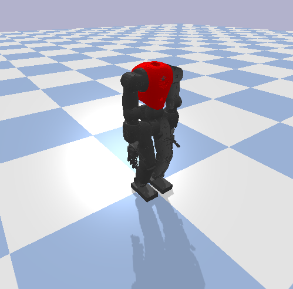
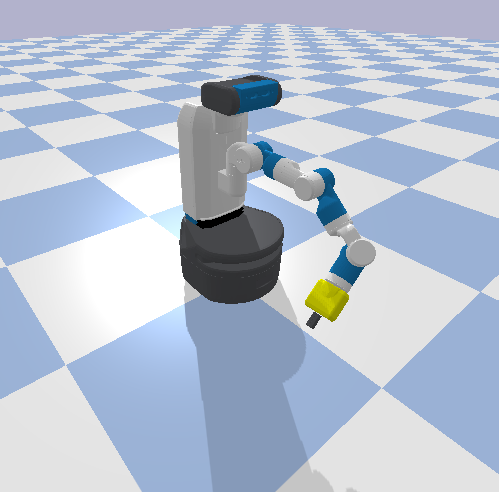
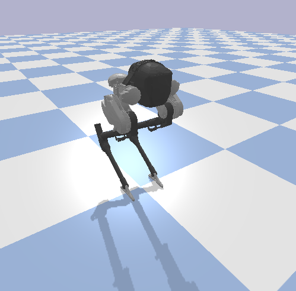
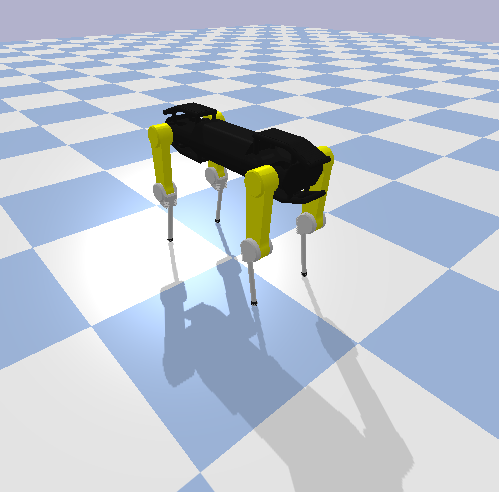
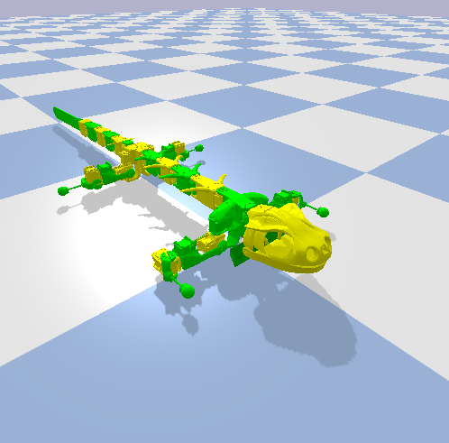
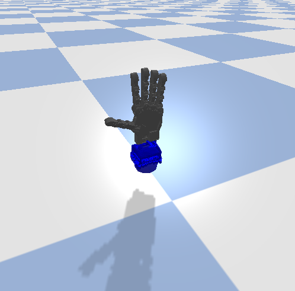
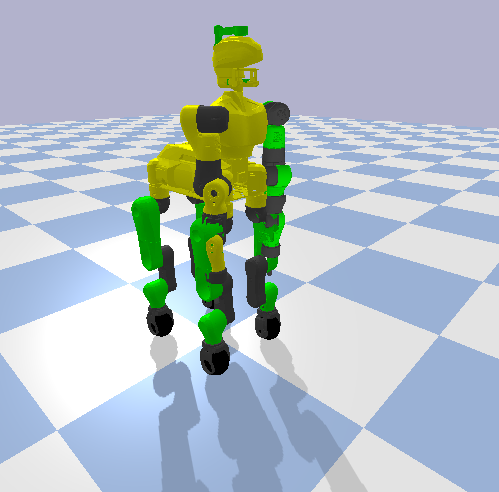
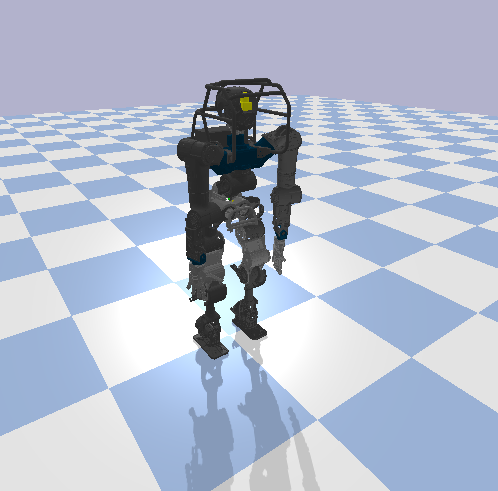
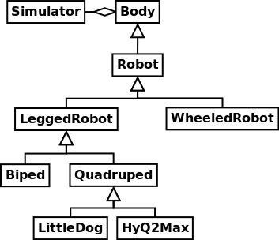

Robots
======

Robots constitute one of the main elements in the *PyRoboLearn* (PRL) framework. PRL provides a high-level abstraction and common interface to all the robots, allowing it for a better consistency and generalization between them. This allows for instance to check if one particular controller or algorithm works with other robots as well.

More than 64 robots have been implemented in PRL and include various kind of robotic platforms. Among them, manipulators, biped robots, quadrupeds, hexapods, wheeled robots, quadcopters, and many others as shown below:

GIF

.. image:: ../figures/wam.png
    :width: 9%
    :alt: wam

.. image:: ../figures/phantomx.png
    :width: 9%
    :alt: phantomx

Note that for few of them such as the ones that require the simulation of fluids such as quadcopters. The corresponding class implements the dynamical simulation. For such classes, as I did not spend too much time one it, some improvements might be needed for better realism.

How to use a robot in PRL?
--------------------------

.. code-block:: python
    :linenos:

    from itertools import count
    import pyrobolearn as prl

    # create simulator
    simulator = prl.simulators.Bullet()

    # create basic world (with floor and gravity)
    world = prl.worlds.BasicWorld(simulator)

    # load robot in the world at the specified (x, y) position (you can also give a (x,y,z) position)
    # For other possible parameters, check the method documentation.
    robot = world.load_robot('robot_name', position=[0., 0.], ...)

    # print some info about the robot
    robot.print_info()
    print(dir(robot))       # print available methods

    # main loop
    for _ in count():

        # perform something with the robot for instance some kinematic / dynamic control
        ...

        # perform a step in the world and sleep for `sim.dt`
        world.step(sim.dt)

You can check for more examples in the `examples/robots <https://github.com/robotlearn/pyrobolearn/tree/master/examples/robots>`_ folder. You can also check for `examples/kinematics <https://github.com/robotlearn/pyrobolearn/tree/master/examples/kinematics>`_ and `examples/dynamics <https://github.com/robotlearn/pyrobolearn/tree/master/examples/dynamics>`_.

Design
------

The most abstract class is the ``Body`` class which is described in `pyrobolearn/robots/base.py <https://github.com/robotlearn/pyrobolearn/blob/master/pyrobolearn/robots/base.py>`_. From it, you can already access to multiple functionalities/attributes, such as its position and orientation. It only depends on the simulator.

Inheriting from one of its child classes is the most interesting (for our purpose) ``Robot`` class, described in `robot.py <https://github.com/robotlearn/pyrobolearn/blob/master/pyrobolearn/robots/robot.py>`_. It is the parent class of several classes such as:

- ``Manipulator`` defined in `manipulator.py <https://github.com/robotlearn/pyrobolearn/blob/master/pyrobolearn/robots/manipulator.py>`_
- ``LeggedRobot`` defined in `legged_robot.py <https://github.com/robotlearn/pyrobolearn/blob/master/pyrobolearn/robots/legged_robot.py>`_
- ``WheeledRobot`` defined in `wheeled_robot.py <https://github.com/robotlearn/pyrobolearn/blob/master/pyrobolearn/robots/wheeled_robot.py>`_
- ``Hand`` defined in `hand.py <https://github.com/robotlearn/pyrobolearn/blob/master/pyrobolearn/robots/hand.py>`_
- etc.

Note that ``Robot`` only depends on the simulator interface (aggregation relationship), and is independent of other modules in PRL (at the exception of some util methods that are useful to perform some transformations).

How to create your own robot?
-----------------------------

To illustrate how to create your own robot, let's assume you want to create a humanoid robot (biped and bi-manipulator) called ``Asimov``.

1. First, you have to get (or create) its URDF file and the associated meshes. Let's put them in a directory called ``asimov``, and move it in the ``pyrobolearn/robots/urdfs/`` folder where all the other URDFs are.

2. If you want to use it directly and to not create a specific class, you can just call:

.. code-block:: python
    :linenos:

    import pyrobolearn as prl

    # create simulator and basic world
    simulator = prl.simulators.Bullet()

    # create world
    world = prl.worlds.BasicWorld(simulator)

    # create robot
    urdf = "path/to/urdf"
    position = None     # position [x,y,[z]]. If None, by default, it will be set to (0,0,0)
    orientation = None  # quaternion [x,y,z,w]. If None, by default, it will be set to (0,0,0,1)
    robot = Robot(simulator, urdf, position, orientation, fixed_base=False)

    # main loop
    while True:
        # do something with robot
        ...

        # perform a step in the world and pause for `sim.dt`
        world.step(sim.dt)

3. Instead of the second point, let's create a proper class ``Asimov`` that inherits from the ``BipedRobot`` and ``BiManipulator`` (and thus inherits their functionalities) in a Python file ``asimov.py``:

.. code-block:: python
    :linenos:

    #!/usr/bin/env python
    """Short description about your robot

    Long description about the robot
    """

    # import libraries you need
    import ...

    # import the classes to inherit from
    from pyrobolearn.robots.legged_robot import BipedRobot
    from pyrobolearn.robots.manipulator import BiManipulator

    class Asimov(BipedRobot, BiManipulator):
        r"""Asimov Robot

        Add description about the robot here, such as the number of degrees of freedom, the various sensors/actuators that are available.

        References:
        - [1] reference 1; e.g. link to the robot webpage
        - [2] reference 2: e.g. link to original URDF
        """

        # define static variables here, e.g.
        BASE_HEIGHT = 1

        def __init__(self, simulator, position=(0, 0, 0), orinetation=(0, 0, 0, 1), fixed_base=False, scale=1., 
                     urdf=os.path.dirname(os.path.abspath(__file__)) + '/relative/path/to/your/urdf/wrt/this/python/file.urdf')
            
            # check parameters and set default parameters if necessary
            if position is None:  # it receives None notably when the world load the robot if a position is not specified
                position = (0, 0, 0)
            if len(position) == 2:  # assume (x,y) are given
                position = tuple(position) + (self.BASE_HEIGHT,)
            if orientation is None:  # it receives None notably when the world load the robot if an orientation is not specified
                orientation = (0, 0, 0, 1)  # quaternion [x,y,z,w]
            if fixed_base is None:  # it receives None notably when the world load the robot if fixed_base is not specified
                fixed_base = False

            # call parent constructor
            super(Asimov, self).__init__(simulator, urdf, position, orientation, fixed_base, scale)

            # define common attributes to all bimanipulator/biped robot (see their respective classes)

            # for bimanipulator
            self.arms = []  # list of arms where each arm is a list of link ids
            self.hands = []  # list of end-effector/hand link ids

            # default values set in BiManipulator class that you can modify if necessary
            # self.left_arm_id, self.left_hand_id = 0, 0        # used e.g. for self.arms[self.left_arm_id]
            # self.right_arm_id, self.right_hand_id = 1, 1      # used e.g. for self.arms[self.right_arm_id]

            # for biped (similar than for bimanipulator): check corresponding `BipedRobot` class
            self.legs = []  # list of legs where a leg is a list of links
            self.feet = []  # list of feet ids
            ...

            # define your own sensors and actuators
            ...

3. If you want to be able to load your robot from the world using its name (by calling ``world.load_robot('asimov')``), add the Python file ``asimov.py`` in the `pyrobolearn/robots/ <https://github.com/robotlearn/pyrobolearn/tree/master/pyrobolearn/robots>`_ folder. The ``__init__.py`` inside that folder will automatically go through all the files and add the robots inside the ``implemented_robots`` list which is accessed by ``World``. Note that you can also accessed to this list by calling ``pyrobolearn.robots.implemented_robots``. If you also want to be able to call your robot using ``from pyrobolearn.robots import Asimov``, you will have to add the line ``from .asimov import Asimov`` in the `pyrobolearn/robots/__init__.py <https://github.com/robotlearn/pyrobolearn/blob/master/pyrobolearn/robots/__init__.py>`_.

4. Now, you can call your robot in the framework.

.. code-block:: python
    :linenos:

    from itertools import count
    import pyrobolearn as prl

    simulator = prl.simulators.Bullet()

    # create world and load robot inside (recommended)
    world = prl.worlds.BasicWorld(simulator)
    robot = world.load_robot('asimov')
    # or directly created the robot in the simulator (not recommended unless you are doing experiments on the real robot 
    # and thus the world is not useful)
    # robot = prl.robots.Asimov(simulator)
    robot.print_info()

    # main loop
    for _ in count():
        world.step(sleep_dt=sim.dt)

Sensors and Actuators
---------------------

* Sensors
* Actuators

FAQs and Troubleshootings
-------------------------

- The mass/inertia matrix of some links are not correct in the simulator, what should I do?
    * If you use the Bullet simulator (which uses ``pybullet``), you have to specify the mass and inertia matrix for each link. If a link doesn't have these attributes defined, pybullet automatically attribute a mass of 1kg and an identity inertia matrix (which is ridiculous huge). Normally, links without a mass and inertia matrices defined in a URDF file are dummy links that are used to represent a reference frame. To set a reasonable inertia matrix, please refer to `"Adding Physical and Collision Properties to a URDF Model" <http://wiki.ros.org/urdf/Tutorials/Adding%20Physical%20and%20Collision%20Properties%20to%20a%20URDF%20Model>`_ and `"Inertial parameters of triangle meshes" <http://gazebosim.org/tutorials?tut=inertia&cat=build_robot>`_.
    * It is possible that some masses / inertia matrices have not been correctly set in the original URDF. I cleaned most of the URDF files but some links might have escaped my attention. Please open an issue on `Github <https://github.com/robotlearn/pyrobolearn>`_, or check the 2 `links <http://wiki.ros.org/urdf/Tutorials/Adding%20Physical%20and%20Collision%20Properties%20to%20a%20URDF%20Model>`_ `above <http://gazebosim.org/tutorials?tut=inertia&cat=build_robot>`_ on how to set reasonable inertia values.

- How to convert a xacro file to a URDF file? Type ``rosrun xacro xacro --inorder path/to/<robot>.urdf.xacro > <robot>.urdf`` or ``rosrun xacro xacro.py --inorder path/to/<robot>.urdf.xacro > <robot>.urdf``

- When I set the ``fixed_base`` to ``False``, the robot has still a fixed base, what is happening? The first link (often called base_link or world_link in most URDF files) shouldn't have a mass/inertia of zero, this causes the robot to have a fixed base. Remove the corresponding tag from the urdf.

- I noticed that some functionalities are missing in one of the robot class? I probably forgot to implement it. Please open an issue on `Github <https://github.com/robotlearn/pyrobolearn>`_ or create a pull request.

- There is an error in one of the functionalities? Or, I have another question or want to suggest an improvement? Please open an issue on `Github <https://github.com/robotlearn/pyrobolearn>`_ or a create a pull request.

Future works
------------

- add more robots. Here are few other robots that might interest the users:
    - `hexapods <https://github.com/resibots/hexapod_ros/tree/master/hexapod_description>`_
    - `ROS robots <https://robots.ros.org/>`_
    - `Universal robots <https://github.com/ros-industrial/universal_robot>`_
- improve the flexibility/modularity by allowing to remove/add/replace links to/from the main robot. For instance:
    - add a gripper to a manipulator robot, or replace a gripper with another
    - remove a leg from a legged robot (which is interesting to simulate damage recovery scenarios)
- might need to define different URDFs for different simulators

References
----------

All the robots were found in the following github repositories (and several were cleaned by me):

- `Aibo <https://github.com/dkotfis/aibo_ros>`_
- `Allegrohand <https://github.com/simlabrobotics/allegro_hand_ros>`_
- `Ant <https://github.com/bulletphysics/bullet3/tree/master/examples/pybullet/gym/pybullet_data/mjcf>`_
- Atlas: `1 <https://github.com/openai/roboschool>`_, `2 <https://github.com/erwincoumans/pybullet_robots>`_
- `Ballbot <https://github.com/CesMak/bb>`_
- `Baxter <https://github.com/RethinkRobotics/baxter_common>`_
- BB8: `1 <http://www.theconstructsim.com/bb-8-gazebo-model/>`_, `2 <https://github.com/eborghi10/BB-8-ROS>`_
- `Blackbird <https://hackaday.io/project/160882-blackbird-bipedal-robot>`_
- `Cartpole <https://github.com/bulletphysics/bullet3/blob/master/data/cartpole.urdf>`_ but modified to be able to have multiple links specified at runtime
- Cassie: `1 <https://github.com/UMich-BipedLab/Cassie_Model>`_, `2 <https://github.com/agilityrobotics/cassie-gazebo-sim>`_, `3 <https://github.com/erwincoumans/pybullet_robots>`_
- `Centauro <https://github.com/ADVRHumanoids/centauro-simulator>`_
- `Cogimon <https://github.com/ADVRHumanoids/iit-cogimon-ros-pkg>`_
- `Coman <https://github.com/ADVRHumanoids/iit-coman-ros-pkg>`_
- `Crab <https://github.com/tuuzdu/crab_project>`_
- `Cubli <https://github.com/xinsongyan/cubli>`_
- `Darwin <https://github.com/HumaRobotics/darwin_description>`_
- `e.Do <https://github.com/Comau/eDO_description>`_
- `E-puck <https://github.com/gctronic/epuck_driver_cpp>`_
- `F10 racecar <https://github.com/erwincoumans/pybullet_robots/tree/master/data/f10_racecar>`_
- `Fetch <https://github.com/fetchrobotics/fetch_ros>`_
- `Franka Emika <https://github.com/frankaemika/franka_ros>`_
- `Half Cheetah <https://github.com/bulletphysics/bullet3/tree/master/examples/pybullet/gym/pybullet_data/mjcf>`_
- `Hopper <https://github.com/bulletphysics/bullet3/tree/master/examples/pybullet/gym/pybullet_data/mjcf>`_
- `Hubo <https://github.com/robEllenberg/hubo-urdf>`_
- `Humanoid <https://github.com/bulletphysics/bullet3/tree/master/examples/pybullet/gym/pybullet_data/mjcf>`_
- `Husky <https://github.com/husky/husky>`_
- `HyQ <https://github.com/iit-DLSLab/hyq-description>`_
- `HyQ2Max <https://github.com/iit-DLSLab/hyq2max-description>`_
- ICub: `1 <https://github.com/robotology-playground/icub-models>`_, `2 <https://github.com/robotology-playground/icub-model-generator>`_. There are currently few problems with this robot.
- `Jaco <https://github.com/JenniferBuehler/jaco-arm-pkgs>`_
- KR5: `1 <https://github.com/a-price/KR5sixxR650WP_description>`_, `2 <https://github.com/ros-industrial/kuka_experimental>`_
- Kuka IIWA: `1 <https://github.com/IFL-CAMP/iiwa_stack>`_, `2 <https://github.com/bulletphysics/bullet3/tree/master/data/kuka_iiwa>`_
- Kuka LWR: `1 <https://github.com/CentroEPiaggio/kuka-lwr>`_, `2 <https://github.com/bulletphysics/bullet3/tree/master/data/kuka_lwr>`_
- `Laikago <https://github.com/erwincoumans/pybullet_robots>`_
- `Little Dog <https://github.com/RobotLocomotion/LittleDog>`_
- `Manipulator2D <https://github.com/domingoesteban/robolearn_robots_ros>`_
- `Minitaur <https://github.com/bulletphysics/bullet3/tree/master/examples/pybullet/gym/pybullet_data/quadruped>`_
- `Lincoln MKZ car <https://bitbucket.org/DataspeedInc/dbw_mkz_ros>`_
- `Morphex <https://gist.github.com/lanius/cb8b5e0ede9ff3b2b2c1bc68b95066fb>`_
- Nao: `1 <https://github.com/ros-naoqi/nao_robot>`_, and `2 <https://github.com/ros-naoqi/nao_meshes>`_
- OpenDog: `1 <https://github.com/XRobots/openDog>`_, and `2 <https://github.com/wiccopruebas/opendog_project>`_
- `Pepper <https://github.com/ros-naoqi/pepper_robot>`_
- `Phantom X <https://github.com/HumaRobotics/phantomx_description>`_
- `Pleurobot <https://github.com/KM-RoBoTa/pleurobot_ros_pkg>`_
- `PR2 <https://github.com/pr2/pr2_common>`_
- `Quadcopter <https://github.com/wilselby/ROS_quadrotor_simulator>`_
- `Rhex <https://github.com/grafoteka/rhex>`_
- `RRbot <https://github.com/ros-simulation/gazebo_ros_demos>`_
- Sawyer: `1 <https://github.com/RethinkRobotics/sawyer_robot>`_, `2 <https://github.com/erwincoumans/pybullet_robots>`_
- `SEA hexapod <https://github.com/alexansari101/snake_ws>`_
- `SEA snake <https://github.com/alexansari101/snake_ws>`_
- `Shadow hand <https://github.com/shadow-robot/sr_common>`_
- `Soft hand <https://github.com/CentroEPiaggio/pisa-iit-soft-hand>`_
- `Swimmer <https://github.com/bulletphysics/bullet3/tree/master/examples/pybullet/gym/pybullet_data/mjcf>`_
- `Valkyrie <https://github.com/openhumanoids/val_description>`_
- `Walker 2D <https://github.com/bulletphysics/bullet3/tree/master/examples/pybullet/gym/pybullet_data/mjcf>`_
- `Walk-man <https://github.com/ADVRHumanoids/iit-walkman-ros-pkg>`_
- `Wam <https://github.com/jhu-lcsr/barrett_model>`_
- `Youbot <https://github.com/youbot>`_: this includes the youbot base without any arms, one kuka arm, 2 kuka arms, and the kuka arm without the wheeled base.
