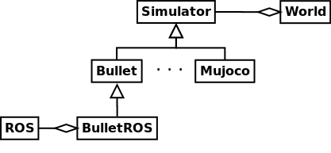

Simulators
==========

The simulator is the starting point in the **PyRoboLearn** (PRL) framework. To avoid a tight coupling with a particular simulator, a ``Simulator`` interface class (from which all the other simulators inherit from) has been implemented. The ``Simulator`` interface notably provides a common interface such that it provides features in the same way without regard to the simulator. For instance, a quaternion might be returned as [x,y,z,w] with one simulator, while with another it could be returned as [w,x,y,z]. This is addressed by the ``Simulator`` interfaces which uses only one convention, and convert if necessary the quaternion returned by the inner simulator. 

Currently, the fully supported simulator is ``pybullet`` through the ``Bullet`` interface. Other simulators such as ``MuJoCo``, ``Dart`` and ``Raisim`` are partially implemented but their full integration is still in progress. 

The general idea is that you would be able to change the simulator if you wish without having to modify any other lines of code. See example below. 

Design
------

The important goal when designing the simulators was that it should be a stand alone interface.

    UML diagram for simulators

Currently, the only fully functional simulator is ``Bullet``. While other simulators have been considered such as Gazebo (with ROS), Mujoco, Dart, and others, few of them required a particular license or do not have strong Python bindings.

Note that each simulator implements static methods which provide information about the simulator itself; if it can for instance simulate fluids or not, etc.

How to use a particular simulator in PRL?
-----------------------------------------

For the moment, the only fully operational interface is ``Bullet``. Some few other interfaces have been partially implemented (see Future works). Here is a snippet on how to use the ``Bullet`` simulator in PRL:

.. code-block:: python

    from itertools import count
    import pyrobolearn as prl

    # create simulator
    simulator = prl.simulators.Bullet()
    # later: you would be able to change the simulator by `BulletROS` or `RBDL_ROS` to command a real robot using ROS

    # create world, robots, etc
    ...

    # main loop
    for _ in count():

        # do something
        ...

        # perform a step in the world and sleep for `sim.dt`
        sim.step(sim.dt)

You can check for more examples in the `examples/simulators <https://github.com/robotlearn/pyrobolearn/tree/master/examples/simulators>`_ folder.

How to create an interface to a simulator?
------------------------------------------

To create your own Simulator, you have to inherit from the ``Simulator`` class defined in `pyrobolearn/simulators/simulator.py <https://github.com/robotlearn/pyrobolearn/blob/master/pyrobolearn/simulators/simulator.py>`_.

.. code-block:: python

    import pyrobolearn as prl

    class MySimulator(prl.simulators.Simulator):
        """Description"""
        # implement all the abstract methods in Simulator

FAQs and Troubleshootings
-------------------------

* What are the differences between `BulletClient <https://github.com/bulletphysics/bullet3/blob/master/examples/pybullet/gym/pybullet_utils/bullet_client.py>`_ and the ``Bullet`` defined in PRL? There are few differences but the design of the abstract ``Simulator`` class as well as the `Bullet` class was heavily inspired by the methods provided in PyBullet. The subtil differences include:
	* a full documentation embedded in the code of ``Bullet``. The documentation for each function provided in the original pybullet is described on a Google doc available `here <https://docs.google.com/document/d/10sXEhzFRSnvFcl3XxNGhnD4N2SedqwdAvK3dsihxVUA>`_. This is not optimal when coding where a user often wants to access the documentation through the code using ``function?`` or ``help(function)`` in a Python console.
	* follow the PEP8 style guideline. For instance, the names of the method are given by ``create_collision_shape`` instead of ``createCollisionShape``.
	* automatic conversion to numpy arrays from lists that are returned by ``pybullet``, and vice-versa. Some methods (not all of them) in the original pybullet raises an error when given a numpy array. I identified these methods and convert these numpy arrays to lists. Also, some matrices returned by some methods in the original pybullet are returned as a list of int/float instead of numpy arrays. The conversion to numpy array and the reshaping to the correct shapes is thus also performed in the ``Bullet`` class.
	* enforce consistency; for instance, some angles that were returned from or provided to some methods in the original pybullet, were for some in degrees while for others in radians. This can lead to some bugs that could be hard to detect if the user is not aware of that. In ``Bullet``, all the returned/provided angles are in radians.

Future works
------------

Currently, I am working on supporting the following simulators:
- the Mujoco interface; I originally did not start with it as it is closed-source and requires a License. However, it is used a lot in research and thus it could be interesting to have it as well.
- the DART interface; there is a minimal implementation of it in PRL where I was mostly playing around with it.
- the RaiSim interface; the ``raisimpy`` python wrapper has been implemented, and a minimal implementation is provided.

My main objectives for future works are the implementation of:
- the Gazebo-ROS interface; a part has already been implemented but it is far from over.
- the Isaac interface if Nvidia provided a nice Python API.

Possible other future works might include the implementation of:
- the opensim interface; this interface is for musculoskeletal models but this can be interesting when testing algorithms/models.
