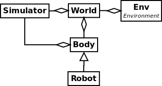

Worlds
======

The world is the second important item in PRL; it is, with the ``Body`` class (see next section), the only class that can access the simulator. As it name implies, it allows you to create a world in the simulator, load various objects in it, and change the world's and objects' physical properties. From it, you can also access to the main camera (if the GUI is enabled in the simulator), and move it as you wish. The world can be seen as a wrapper around the simulator which provides you extra functionalities where each function calls different methods of the simulator. Finally, the world also allows you to load and generate terrains.

Design
------

As it can be seen on the UML diagram below the ``World`` depends on the ``Simulator`` and the various ``Body`` (see next section) loaded in it (as well as few util functions).

    UML diagram for world

Later, we will see that world is notably given to the environment along with the states and rewards.

How to use the world in PRL?
----------------------------

Here is a snippet showing how to create a simple world in PRL:

.. code-block:: python
    :linenos:

    from itertools import count
    import pyrobolearn as prl

    # create simulator
    simulator = prl.simulators.Bullet()

    # create basic world (with floor and gravity)
    world = prl.worlds.BasicWorld(simulator)

    # load a sphere in the world
    sphere = world.load_sphere(position=[0, 0, 5])

    # run the simulator
    for t in count():
    	# follow the sphere falling with the main camera
    	world.camera.follow(sphere, distance=2)

    	# perform a step in the simulator and sleep for `sim.dt`
    	world.step()

Note that you can get access to the world camera, and change its position and orientation. You can also follow an object moving with the camera as done in the code above.

For more examples, you can check the `examples/worlds <https://github.com/robotlearn/pyrobolearn/tree/master/examples/worlds>`_ folder.

How to create your own world?
-----------------------------

Creating your own world basically boils down to inheriting from the ``World`` or ``BasicWorld`` (if you want a floor and enable gravity by default) class, and write in the constructor what you want your world to load when instantiated.

FAQs and Troubleshootings
-------------------------

- Why do the ``Body`` class (and all the classes that inherit from it such as ``Robot``) can access the simulator as well? 
	- This is because, creating a world when the ``Simulator`` consists to be the real world doesn't make much sense. The ``Robot`` is completely independent of the ``World``, while the converse is not true.
- I got an error while loading a 3D object / mesh?
	- The most common error is because the given format is not supported by the simulator. Try to convert it in ``.obj`` using for instance `meshlab <http://www.meshlab.net/>`_ (which is an open-source free tool to process and edit 3D meshes)

Where can I find 3d models to load in the world?
------------------------------------------------

- If it a combination of simple shapes linked together, you can build it in the simulator.
- `Pybullet data <https://github.com/bulletphysics/bullet3/tree/master/data>`_
- `Gazebo database <https://bitbucket.org/osrf/gazebo_models/src/default/>`_
- `Turbosquid <www.turbosquid.com>`_
- `free3d <free3d.com>`_
- `sketchfab <sketchfab.com>`_
