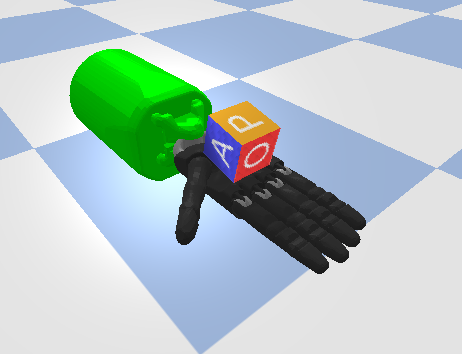

### Learning Dexterous In-Hand Manipulation

Status: ongoing

Abstract (from [1]): "We use reinforcement learning (RL) to learn dexterous in-hand manipulation policies which can 
perform vision-based object reorientation on a physical Shadow Dexterous Hand. The training is performed in a simulated 
environment in which we randomize many of the physical properties of the system like friction coefficients and an 
object's appearance. Our policies transfer to the physical robot despite being trained entirely in simulation. Our 
method does not rely on any human demonstrations, but many behaviors found in human manipulation emerge naturally, 
including finger gaiting, multi-finger coordination, and the controlled use of gravity. Our results were obtained 
using the same distributed RL system that was used to train OpenAI Five. We also include a video of our results: 
[this url](https://www.youtube.com/watch?v=jwSbzNHGflM)."


#### Implementation details

From the paper [1]:

* simulator: Mujoco [2]
* robot: ShadowHand [3]
* states:
    * for value network: fingertip positions (5*3D), object position (3D), object orientation (4D=quaternion), 
        target orientation (4D=quaternion), relative target orientation (4D=quaternion), hand joint angles (24D), 
        hand joint velocities (24D), object velocity (3D), object angular velocity (3D)
    * for policy: fingertip positions (5*3D), object position (3D), relative target orientation (4D=quaternion)
* actions: desired joint angles of the hand relative to the current ones. The actions are discretized into 11 bins. 
* policy: fully-connected neural network composed of a normalization layer, dense ReLU (1024), LSTM (512)
* value: fully-connected neural network composed of a normalization layer, dense ReLU (1024), LSTM (512)
* reward function:
    * `r_t = d_t - d_{t+1}`, where `d_t` and `d_{t+1}` are the rotation angles between the desired and current object 
    orientations before and after the transition, respectively.
    * 5 if the goal is achieved
    * -20 if the object drop
* termination condition (goal): 
* exploration: in the action space using a categorical distribution with 11 bins for each action coordinate
* RL algorithm: PPO
    * clip parameter=0.2, entropy regularization coefficient=0.01, GAE(discount factor=0.998, lambda=0.95)), Adam 
    optimizer with learning rate=3e-4.

Compared to [1], we use the PyBullet simulator [4] and not Mujoco (because of its license), and we do not use a pose 
estimation network (i.e. the convolutional neural network).


#### Results

<p align="center">
    
</p>

TODO: figures + plots + link to video


#### References

- [1] ["Learning Dexterous In-Hand Manipulation"](https://arxiv.org/abs/1808.00177), OpenAI et al., 2018
```
@article{openai2018learning,
  title={Learning dexterous in-hand manipulation},
  author={OpenAI and Andrychowicz, Marcin and Baker, Bowen and Chociej, Maciek and Jozefowicz, Rafal and McGrew, Bob and Pachocki, Jakub and Petron, Arthur and Plappert, Matthias and Powell, Glenn and Ray, Alex and others},
  journal={arXiv preprint arXiv:1808.00177},
  year={2018}
}
```
- [2] ["Mujoco: A physics engine for model-based control"](http://citeseerx.ist.psu.edu/viewdoc/download?doi=10.1.1.296.6848&rep=rep1&type=pdf), 
    Todorov et al., 2012
- [3] [ShadowHand](https://www.shadowrobot.com/products/dexterous-hand/) 
    ([URDF](https://github.com/shadow-robot/sr_common))
- [4] ["PyBullet, a Python module for physics simulation for games, robotics and machine learning"](https://github.com/bulletphysics/bullet3), 
    Coumans et al., 2017


The 3D cube (the OBJ file as well as the texture) used for this experiment was modeled by Melissa Britelle based on 
the cube showed in the paper [1].


#### What's next?

Next possible interesting tasks:
- Use various tools (see )
- juggle different objects (balls, clubs, different objects)