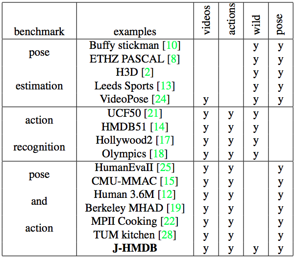

## 3D datasets

This repo contains a brief description of 3D datasets that I could find online. It also contains the Python code to load, parse, and plot some of these datasets.

### List of datasets

Here is a non-exhaustive list of datasets that could be used:

* [**TUM Kitchen**: "The TUM Kitchen Data Set of Everyday Manipulation Activities for Motion Tracking and Action Recognition", 2009](https://ias.in.tum.de/dokuwiki/software/kitchen-activity-data)
    * scenarios: "everyday manipulation  activities  in  a  natural  kitchen  environment"
    * labeled segmented data: 51 DOF articulated human model, 3D joint positions, videos and labels
* [**CMU-MMAC**: "Guide to the Carnegie Mellon University Multimodal Activity database", 2009](http://kitchen.cs.cmu.edu/)
    * scenarios: human activity of subjects performing the tasks involved in cooking and food preparation
* [**HumanEva**: "HumanEva: Synchronized Video and Motion Capture Dataset and Baseline Algorithm for Evaluation of Articulated Human Motion", 2010](http://humaneva.is.tue.mpg.de/)
    * 6 scenarios: walking, jogging, gesturing, throwing and catching a ball, boxing, combo (=walking+jogging+balancing)
    * nb of subjects: 4
    * data: 2D and 3D pose estimation
* [**MPII Cooking**: "A database for fine grained activity detection of cooking activities", 2012](https://www.mpi-inf.mpg.de/departments/computer-vision-and-multimodal-computing/research/human-activity-recognition/mpii-cooking-activities-dataset/)

    * nb of subjects: 12
    * 65 fine-grained cooking activities: background activity, change temperature, cut apart, cut dice, cut in, cut off ends, cut out inside, cut slices, cut stripes, dry, fill water from tap, grate, lid: put on, lid: remove, mix, move from X to Y, open egg, open tin, open/close cupboard, open/close drawer, open/close fridge, open/close oven, package X, peel, plug in/out, pour, pull out, puree, put in bowl, put in pan/pot, put on bread/dough, put on cutting-board, put on plate, read, remove from package, rip open, scratch off, screw close, screw open, shake, smell, spice, spread, squeeze, stamp, stir, strew, take & put in cupboard, take & put in drawer, take & put in fridge, take & put in oven, take & put in spice holder, take ingredient apart, take out from cupboard, take out from drawer, take out from fridge, take out from oven, take out from spice holder, taste, throw in garbage, unroll dough, wash hands, wash objects, whisk, wipe clean
    * labeled and segmented data: 2D body joint positions
* [**J-HMDB**: "Joint-annotated Human Motion Data Base", 2013](http://jhmdb.is.tue.mpg.de/)

    * 21 scenarios: brush hair, catch, clap, climb stairs, golf, jump, kick ball, pick, pour, pull-up, push, run, shoot
ball, shoot bow, shoot gun, sit, stand, swing baseball, throw, walk, wave
    * labeled and segmented data: 36-55 clips per action class with each clip containing 15-40 frames + 2D joint positions. 10 body parts connected by 13 joints (shoulder, elbow, wrist, hip, knee, ankle, neck)  and  two  landmarks  (face  and  belly).
* [**Human 3.6M**: "Human3.6M: Large Scale Datasets and Predictive Methods for 3D Human Sensing in Natural Environments", 2014](http://vision.imar.ro/human3.6m/description.php)
    * 3.6 million 3D human poses and corresponding images
    * nb of subjects: 11
    * 15 scenarios: direction, discussion, eating, activitie while seated, greeting, taking photo, posing, making purchases, smoking, waiting, walking, sitting on chair, talking on the phone, walking dog, walking together
    * data: 3D joint positions and joint angles
* [**UTD-MHAD**: "UTD-MHAD: A Multimodal Dataset for Human Action Recognition utilizing a Depth Camera and a Wearable Inertial Sensor", 2015](http://www.utdallas.edu/~kehtar/UTD-MHAD.html)
    * nb of subjects: 8
    * 27 different actions: (1) right arm swipe to the left, (2) right arm swipe to the right, (3) right hand wave, (4) two hand front clap, (5) right arm throw, (6) cross arms in the chest, (7) basketball shoot, (8) right hand draw x, (9) right hand draw circle (clockwise), (10) right hand draw circle (counter clockwise), (11) draw triangle, (12) bowling (right hand), (13) front boxing, (14) baseball swing from right, (15) tennis right hand forehand swing, (16) arm curl (two arms), (17) tennis serve, (18) two hand push, (19) right hand knock on door, (20) right hand catch an object, (21) right hand pick up and throw, (22) jogging in place, (23) walking in place, (24) sit to stand, (25) stand to sit, (26) forward lunge (left foot forward), (27) squat (two arms stretch out).
    * labeled and segmented data: 861 data sequences, 3D skeleton joint positions
* [**G3D**: "G3D: A Gaming Action Dataset and Real Time Action Recognition Evaluation Framework", 2012](http://dipersec.king.ac.uk/G3D/index.html)
    * nb of subjects: 10
    * 20 gaming actions: punch right, punch left, kick right, kick left, defend, golf swing, tennis swing forehand, tennis swing backhand, tennis serve, throw bowling ball, aim and fire gun, walk, run, jump, climb, crouch, steer a car, wave, flap and clap
    * data: 3D joint positions
* [**CMU-Datasets**](mocap.cs.cmu.edu/search.php)
    * dataset: very diverse, contains data such as sport activities (soccer, dancing, etc), everyday movements/activities, locomotion (walk/run, jump, etc), interaction with environment and other agents, human subjects imitating animal behaviors (such as snake, dog, chicken, etc), stretching, finegrained movements, and so on.
    * data: 3D joint positions and videos.
* Others: MSRC-12 Kinect Gesture Datase, MPI HDM05 Motion Capture Database, MSR Action3D Database, VGG Human Pose Estimation datasets, etc. 
 

### Python Code

The python code to load, parse, and plot (using animations) has been implemented for the following datasets:

* UTD-MHAD: see `utd-mhad.ipynb`
* CMU-Datasets: see `cmu.ipynb`
